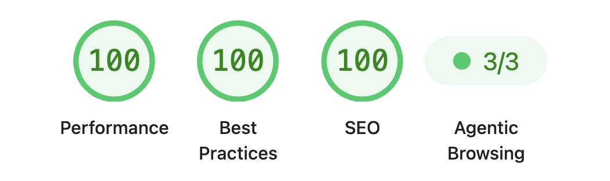

#  bakemd

## Do you really need a ton of js over docs?

This package is built around that question. **bakemd** simply renders md files into html for you to serve.

Set the theme and all necessary SEO attributes in a config (see [configuration](docs/configuration.md)), then:

```sh
npx bakemd build
```

The output is a `dist` folder with html files that any tool can serve.

### What's in the dist

- all your md files as html files
- `7kb` of css
- `1.1kb` of js: theme switching and a copy-to-clipboard script, that's it.

Lighthouse:



### Additional features

- dev mode with HMR: `npx bakemd dev`
- mobile-friendly layout
- set detailed SEO attributes
- sitemap.xml autogenerated
- llms.txt autogenerated

### Limitations

JS is almost non-existent. That's because React, which is used to render the html pages, is not in the client bundle. If you want a lot of interactivity, this package is not for you.

## Docs

The full documentation lives in [`docs/`](docs) and is written with bakemd, so it doubles as the example: its own theme, logo and fonts.

- [Getting started](docs/getting-started.md) walks through the first build.
- [Writing pages](docs/writing.md) covers frontmatter and routes.
- [Configuration](docs/configuration.md) lists every `bakemd.json` field.
- [Theming](docs/theming.md) covers [colors](docs/theming/colors.md) and [fonts](docs/theming/fonts.md).
- [Output and deploy](docs/deploy.md) covers nginx and Docker.
- [CLI](docs/cli.md) lists commands and flags.

```sh
pnpm docs
```

That compiles the CLI into `dist/` and bakes `docs/` into `docs-dist/`.

## Developing

`pnpm dev` serves `docs/` from the sources on port 5174. Edits to `src/`,
the styles and the Markdown reload the page; edits to `lib/` or `bin/`
restart the server and the page reloads once it is back.

`src/` is TypeScript and the published package is `dist/` only, so build
before running the CLI outside dev:

```sh
pnpm build
node dist/bin/bakemd.js build path/to/docs --out out
```

`pnpm lint` and `pnpm typecheck` run against the sources; `pnpm publish` runs
both and then builds.
